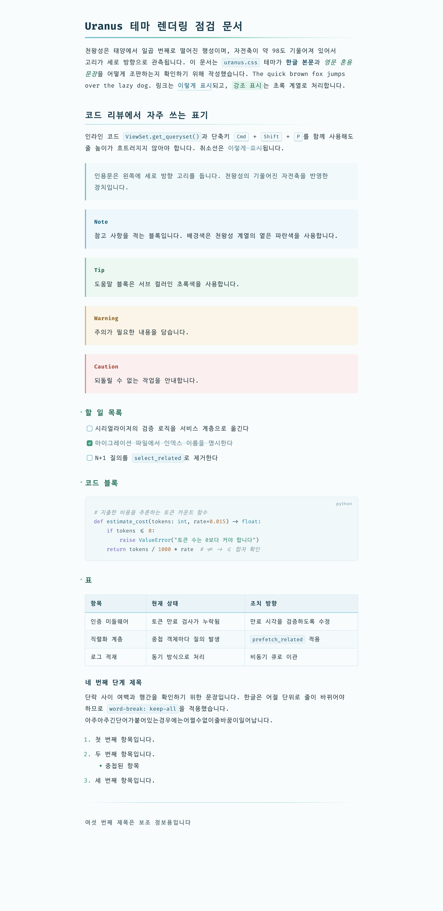
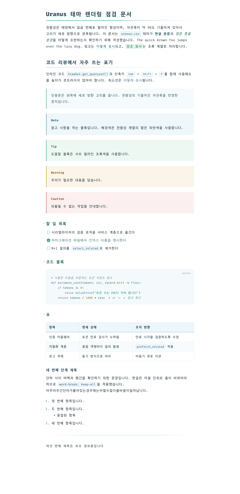

# Typora Uranus Theme

천왕성을 모티프로 삼은 Typora 라이트 테마입니다. 한글로 작성된 긴 리뷰 문서를 오랫동안 읽어도 눈이 덜 피로하도록 조판했습니다.

배경색만 다른 두 가지 변형을 함께 제공합니다.

| 테마 | 파일 | 본문 배경 |
| --- | --- | --- |
| Uranus | `uranus.css` | `#f8fcfd` (아주 옅은 청색 종이) |
| Uranus White | `uranus-white.css` | `#ffffff` (순백) |

## 미리보기

### Uranus



### Uranus White



저장소에 포함된 `preview.md`를 Typora에서 열면 위와 같은 화면을 직접 확인할 수 있습니다.

## 설계 기준

### 한글 조판

긴 문서를 통독할 때의 피로도를 한 화면에 담기는 분량보다 우선하여 다음과 같이 설정했습니다.

- 행간은 1.9배, 자간은 0.01em으로 표준보다 넉넉하게 잡았습니다.
- 본문 폭은 820px이며, 화면 폭이 1500px을 넘으면 860px까지 넓어집니다. 한글 기준으로 한 줄에 40자 남짓 들어가므로 시선이 되돌아오는 거리가 짧습니다.
- `word-break: keep-all`을 적용해서 어절 중간에서 줄이 바뀌지 않습니다.
- 양쪽 정렬은 사용하지 않습니다. 한글에서 양쪽 정렬은 어절 사이 간격이 들쭉날쭉해져서 오히려 읽기 어려워지기 때문입니다.

### 폰트

한글은 **D2Coding ligature**로, 영문과 기호는 **Fira Code**로 조판합니다. D2Coding ligature의 합자 디자인은 Fira Code 계열의 합자 규칙을 따라 만들어졌기 때문에, 두 폰트를 섞어 써도 `->`, `=>`, `!=` 같은 기호의 모양이 서로 어긋나지 않습니다.

폰트 스택을 `"Fira Code", "D2Coding ligature", ...` 순서로 지정했으므로, 영문과 숫자는 Fira Code가 담당하고 한글은 자동으로 D2Coding ligature로 넘어갑니다. 사이드바와 메뉴 같은 애플리케이션 영역에는 **Pretendard**를 사용합니다.

세 폰트 중 설치되지 않은 것이 있으면 시스템 기본 고정폭 폰트로 대체되며, 테마 자체는 정상적으로 동작합니다.

### 색상

천왕성의 옅은 청록빛 파란색을 아홉 단계로, 같은 명도의 초록색을 여덟 단계로 정의해서 CSS 변수로 관리합니다. 옅은 단계는 배경과 테두리에 사용하고, 짙은 단계는 링크와 강조 텍스트에 사용합니다. 링크 색상 `#256580`은 배경과의 명도 대비가 약 6.2대 1이므로 웹 접근성 기준(WCAG AA)을 충족합니다.

### 천왕성 모티프

천왕성은 자전축이 약 98도 기울어져 있어서 고리가 세로 방향으로 관측됩니다. 이 특징을 두 곳에 반영했습니다.

- 인용문 왼쪽에는 파란색에서 초록색으로 이어지는 세로 방향 고리 선을 둡니다.
- h1과 h2 아래에는 같은 그라데이션을 옆에서 본 형태의 가로 밑줄을 배치합니다.

### 리뷰 문서를 위한 요소

- GitHub 형식의 경고 블록 다섯 종류(`> [!NOTE]`, `> [!TIP]`, `> [!IMPORTANT]`, `> [!WARNING]`, `> [!CAUTION]`)를 각각 다른 색으로 구분합니다.
- 할 일 목록에서 완료된 항목은 글자를 흐리게 처리하고 취소선을 그어, 남은 항목이 먼저 눈에 들어오도록 했습니다.
- 코드 블록 우측 상단에 언어 이름을 작게 표시합니다.
- 표는 줄무늬 배경과 넉넉한 셀 여백을 사용하며, 셀 안에서도 어절 단위로 줄이 바뀝니다.
- Mermaid 다이어그램과 MathJax 수식의 색상을 본문과 같은 계열로 맞추었습니다.
- 인쇄와 PDF 내보내기에서 제목이 페이지 끝에 홀로 남지 않도록 처리했고, 코드 블록과 표가 페이지 경계에서 잘리지 않게 했습니다.

## 설치

### 1. 폰트 설치

| 폰트 | 용도 | 내려받기 |
| --- | --- | --- |
| D2Coding ligature | 한글 본문 | [naver/d2codingfont](https://github.com/naver/d2codingfont) |
| Fira Code | 영문 본문 및 코드 | [tonsky/FiraCode](https://github.com/tonsky/FiraCode) |
| Pretendard | 사이드바와 메뉴 | [orioncactus/pretendard](https://github.com/orioncactus/pretendard) |

D2Coding은 배포 파일 안에 일반 버전과 ligature 버전이 함께 들어 있습니다. 두 가지를 모두 설치해도 무방하지만, 테마가 참조하는 이름은 `D2Coding ligature`입니다.

### 2. 테마 파일 복사

Typora의 `환경 설정 → 외관 → 테마 폴더 열기`를 눌러 테마 폴더를 연 다음, `uranus.css`와 `uranus-white.css`를 그 안에 복사합니다. 두 파일은 반드시 같은 폴더에 있어야 합니다. `uranus-white.css`가 `@import`로 `uranus.css`를 불러오기 때문입니다.

운영체제별 기본 경로는 다음과 같습니다.

| 운영체제 | 경로 |
| --- | --- |
| macOS | `~/Library/Application Support/abnerworks.Typora/themes` |
| Windows | `%APPDATA%\Typora\themes` |
| Linux | `~/.config/Typora/themes` |

### 3. Typora 다시 시작

Typora를 다시 실행하면 `테마` 메뉴에 **Uranus**와 **Uranus White**가 나타납니다.

## 사용자 정의

색상과 여백은 모두 `uranus.css` 상단의 `:root` 블록에 CSS 변수로 모여 있습니다. 자주 조정하게 되는 변수는 다음과 같습니다.

| 변수 | 기본값 | 설명 |
| --- | --- | --- |
| `--content-width` | `820px` | 본문 최대 폭 |
| `--bg-color` | `#f8fcfd` | 본문 배경색 |
| `--text-color` | `#20343b` | 본문 글자색 |
| `--accent-color` | `#256580` | 링크와 강조 텍스트 |
| `--font-mono` | `"Fira Code", "D2Coding ligature", ...` | 본문 폰트 스택 |
| `--code-bg-color` | `#f1f8fa` | 코드 블록 배경색 |

행간과 자간은 `body` 규칙의 `line-height`와 `letter-spacing`에서 조정합니다.

테마 파일을 직접 고치는 대신 Typora의 사용자 정의 CSS 기능을 사용하려면, 테마 폴더에 `base.user.css` 파일을 만들고 그 안에서 같은 변수를 다시 정의하면 됩니다. 이렇게 하면 테마를 갱신해도 조정한 내용이 남습니다.

## 저장소 구성

```
.
├── uranus.css          # 기본 테마 (모든 조판 규칙을 담고 있음)
├── uranus-white.css    # 흰 배경 변형 (표면 색상 변수만 재정의)
├── preview.md          # 테마 확인용 예시 문서
└── screenshots/        # README에 사용한 미리보기 이미지
```

`uranus-white.css`는 `@import url("./uranus.css")`로 기본 테마를 불러온 뒤 표면 색상 변수만 덮어씁니다. 폰트와 여백, 모티프 같은 조판 규칙이 한 파일에만 존재하므로, 수정할 때 두 테마가 서로 어긋나지 않습니다.

## 호환성

Typora 1.14.9(macOS)에서 제작하고 확인했습니다. 테마를 작성하는 과정에서 Typora의 기본 스타일시트를 직접 확인하여, 우선순위가 더 높은 기본 규칙과 충돌하는 부분을 다음과 같이 맞추었습니다.

- 경고 블록의 테두리 색상은 기본 스타일시트가 `.md-alert.md-alert-note` 형태로 지정하므로, 테마도 같은 형태로 선택자를 작성했습니다.
- 체크박스는 기본 규칙 `#write input[type=checkbox]`가 크기를 강제하기 때문에, 상자를 `::before` 가상 요소에 SVG로 그립니다.
- 표 헤더의 아래 경계선은 기본 규칙 `table tr th { border-bottom: 0 }`이 막고 있어서, 더 구체적인 선택자를 사용했습니다.
- CodeMirror가 코드의 각 줄을 `pre` 요소로 그리기 때문에, 코드 블록 안쪽의 `pre`는 블록 단위 스타일을 되돌리도록 처리했습니다.
