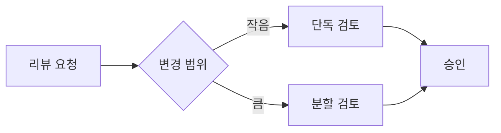

# Uranus 테마 렌더링 점검 문서

천왕성은 태양에서 일곱 번째로 떨어진 행성이며, 자전축이 약 98도 기울어져 있어서 고리가 세로 방향으로 관측됩니다. 이 문서는 `uranus.css` 테마가 **한글 본문**과 *영문 혼용 문장*을 어떻게 조판하는지 확인하기 위해 작성했습니다. The quick brown fox jumps over the lazy dog. 링크는 [이렇게 표시](https://example.com)되고, ==강조 표시==는 초록 계열로 처리합니다.

## 코드 리뷰에서 자주 쓰는 표기

인라인 코드 `ViewSet.get_queryset()`과 단축키 <kbd>Cmd</kbd> + <kbd>Shift</kbd> + <kbd>P</kbd>를 함께 사용해도 줄 높이가 흐트러지지 않아야 합니다. 취소선은 ~~이렇게 표시~~됩니다.

> 인용문은 왼쪽에 세로 방향 고리를 둡니다. 천왕성의 기울어진 자전축을 반영한 장치입니다.

> [!NOTE]
> 참고 사항을 적는 블록입니다. 배경색은 천왕성 계열의 옅은 파란색을 사용합니다.

> [!TIP]
> 도움말 블록은 서브 컬러인 초록색을 사용합니다.

> [!IMPORTANT]
> 놓치면 안 되는 내용을 담습니다.

> [!WARNING]
> 주의가 필요한 내용을 담습니다.

> [!CAUTION]
> 되돌릴 수 없는 작업을 안내합니다.

### 할 일 목록

- [ ] 시리얼라이저의 검증 로직을 서비스 계층으로 옮긴다
- [x] 마이그레이션 파일에서 인덱스 이름을 명시한다
- [ ] N+1 질의를 `select_related`로 제거한다

### 코드 블록

```python
# 지출한 비용을 추론하는 토큰 카운트 함수
def estimate_cost(tokens: int, rate=0.015) -> float:
    if tokens <= 0:
        raise ValueError("토큰 수는 0보다 커야 합니다")
    return tokens / 1000 * rate  # != -> <= 합자 확인
```

### 표

| 항목 | 현재 상태 | 조치 방향 |
| --- | --- | --- |
| 인증 미들웨어 | 토큰 만료 검사가 누락됨 | 만료 시각을 검증하도록 수정 |
| 직렬화 계층 | 중첩 객체마다 질의 발생 | `prefetch_related` 적용 |
| 로그 적재 | 동기 방식으로 처리 | 비동기 큐로 이관 |

#### 네 번째 단계 제목

단락 사이 여백과 행간을 확인하기 위한 문장입니다. 한글은 어절 단위로 줄이 바뀌어야 하므로 `word-break: keep-all`을 적용했습니다. 아주아주긴단어가붙어있는경우에는어쩔수없이줄바꿈이일어납니다.

1. 첫 번째 항목입니다.
2. 두 번째 항목입니다.
   - 중첩된 항목
3. 세 번째 항목입니다.

### 다이어그램



### 수식

인라인 수식 $E = mc^2$ 과 블록 수식을 모두 지원합니다.

$$
\sum_{i=1}^{n} \frac{t_i}{1000} \times r
$$

---

###### 여섯 번째 제목은 보조 정보용입니다
